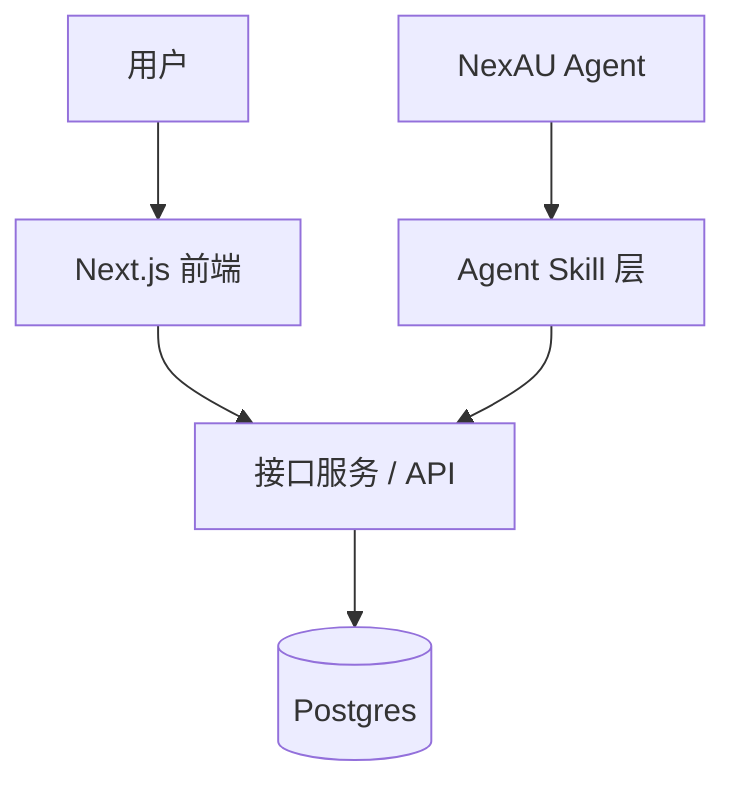

# north-hackathon-team-5-ordering

RFC-0002 点餐系统本地 MVP 仓库。

## 本地部署拓扑

本地演示环境按 RFC-0002 划分为四个模块边界：

| 模块 | 路径 | 职责 |
| --- | --- | --- |
| Next.js 前端 | `apps/web` | 菜单管理、推荐结果展示、图片候选确认入口 |
| 接口服务 | `apps/api` | REST API、推荐引擎、图片候选接口、数据库访问边界 |
| Postgres | `docker/compose.yaml` | 本地持久化数据库 |
| Agent skill | `services/agent` | NexAU Agent 到 API 服务的 skill 包装层 |
| 共享包 | `packages/shared` | 前后端与 Agent skill 共享类型、DTO、常量 |

调用关系：



## 本地启动

1. 复制环境变量模板：

   ```bash
   cp docker/.env.example docker/.env
   ```

2. 启动 Postgres、执行迁移并启动真实 API：

   ```bash
   cd docker
   docker compose up --build postgres migrate api
   ```

3. 在另一个终端启动 Next.js 前端：

   ```bash
   cd apps/web
   npm install
   npm run dev
   ```

4. 可选启动 Agent：

   ```bash
   python -m services.agent.run
   ```

## 环境变量

- `DATABASE_URL`：API 服务内部连接 Postgres 的 URL，Docker Compose 中默认指向 `postgres:5432/ordering`。
- `API_CORS_ORIGIN`：前端默认来源，本地为 `http://localhost:3000`。
- `API_PORT`：接口服务端口，本地默认 `3001`。
- `POSTGRES_PORT`：宿主机暴露端口，本地默认 `5432`。

## 当前状态

- RFC-0002：Postgres schema、迁移、菜单 CRUD、图片候选和推荐 API 已实现。
- RFC-0003：六步前端 Demo 已实现，HTTP Adapter 优先接入 API/Postgres，API 不可用时自动降级为 Mock。

## 环境变量与 smoke test

1. 复制 `.env.example` 为 `.env`，填写 `OPENAI_API_KEY`、`LLM_API_KEY`、`LLM_BASE_URL`、`LLM_MODEL` 等配置。
2. 可选：运行 smoke test：`python scripts/smoke_llm.py`

CI 默认不真实调用 LLM；需要验证 OpenAI-compatible 网关时，设置 `RUN_LLM_SMOKE=true` 并提供对应 `LLM_API_KEY` 与 `LLM_BASE_URL`。
