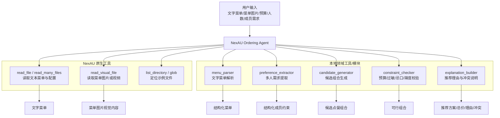
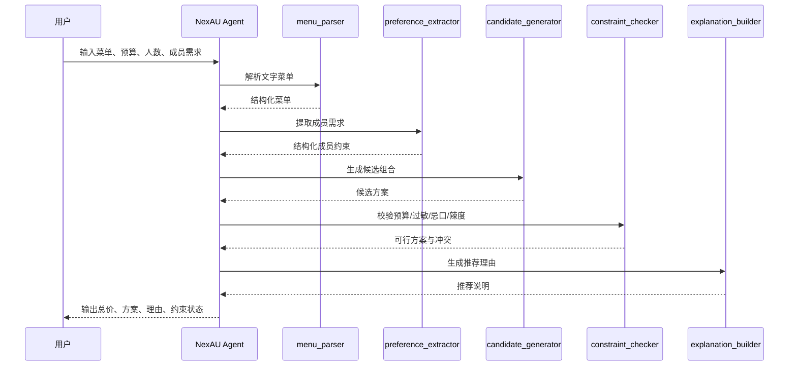
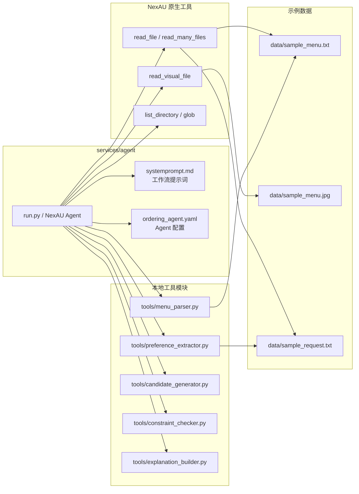
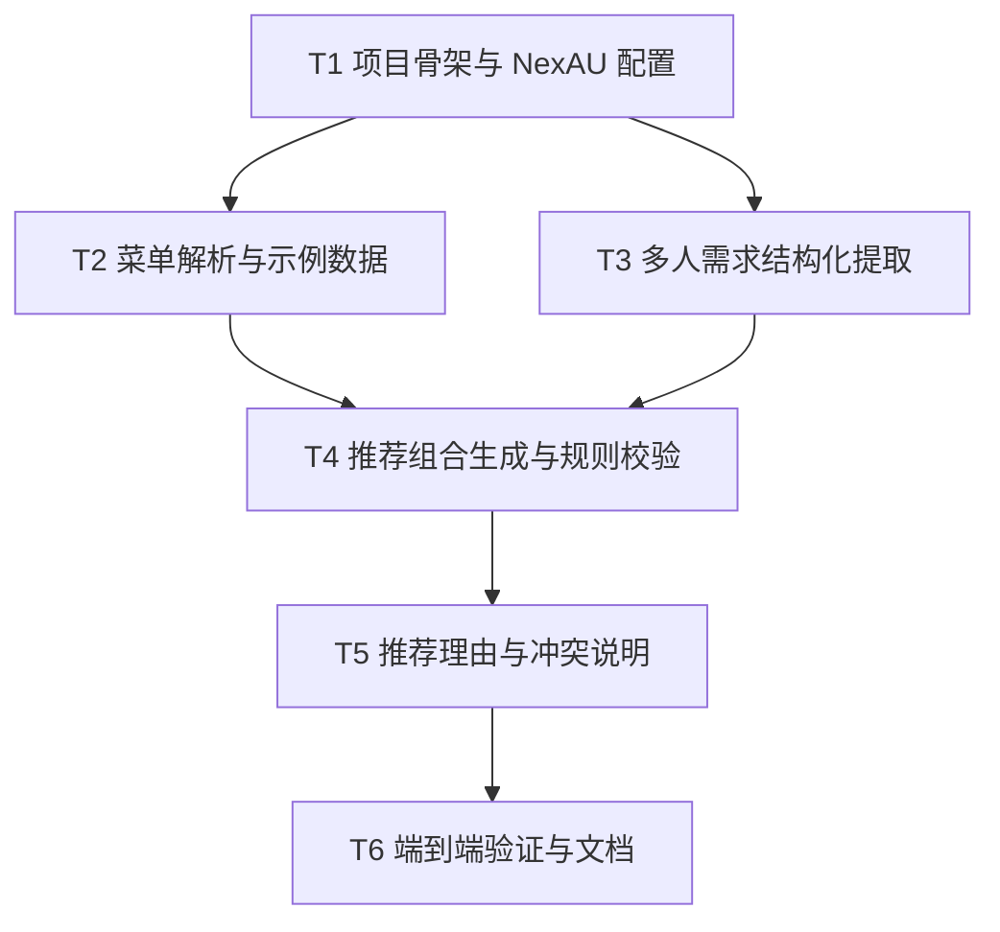

# RFC-0001: NexAU 多人点餐推荐 Agent

## 摘要

本 RFC 设计一个基于 NexAU 框架的本地点餐推荐 Agent。Agent 面向多人点餐场景，接收文字菜单、总预算、人数以及每名成员用自然语言描述的偏好、忌口、过敏、辣度、甜度等约束，生成满足预算和个人限制的推荐点餐方案，并输出总价、推荐理由、已满足约束与无法完全满足的条件。

本 RFC 首期聚焦 MVP：本地 NexAU Agent、文字菜单输入、多人自然语言需求提取、预算约束、推荐组合与理由解释。菜单图片 OCR、人工校正、优惠券/满减、多目标优化、共享策略、替代方案和为他人打包等挑战能力作为后续扩展，不在首期实现范围内。

## 动机

多人点餐的难点不在于计算总价，而在于把分散的自然语言约束转化为可执行的推荐决策：例如“完全不吃辣”“可以微辣但不吃猪肉”“对花生过敏”等需求需要被分别识别、结构化，并在推荐组合时作为硬约束处理。如果只依赖 LLM 直接生成方案，容易出现预算超支、过敏风险、忌口遗漏或结果不可复现等问题。

NexAU 框架提供 Agent 配置、工具绑定、结构化调用、技能与中间件能力，适合承载“自然语言理解 + 工具化规则校验 + 可解释输出”的点餐 Agent。通过把菜单解析、需求提取、组合推荐、约束校验和解释生成拆成明确工具/模块，可以在保持 LLM 灵活性的同时，用规则层保证预算和过敏/忌口等关键约束。

## 设计

### 概述

首期交付为一个本地 NexAU Agent，位于当前新仓库内，第三方框架依赖使用远程 NexAU 仓库。Agent 以交互式或脚本化方式运行：用户输入文字菜单、预算、人数和成员需求；Agent 优先调用 NexAU 原生工具处理文件读取、目录浏览和视觉文件读取，再调用本地领域工具解析菜单、提取成员约束、生成候选组合、执行规则校验，并最终生成可解释的点餐方案。



### 范围与非目标

#### 首期范围

- 在空仓库中创建本地 NexAU Agent 示例项目。
- 使用 NexAU 原生工具作为基础能力：`read_file` / `read_many_files` 读取文字菜单和示例文件，`list_directory` / `glob` 定位文件，`read_visual_file` 读取菜单图片或视频。
- 支持用户粘贴文字菜单，并解析菜名、价格和可选标签信息。
- 支持用户上传或指定本地菜单图片路径，通过 NexAU `read_visual_file` 将图片视觉内容交给多模态 LLM；首期不做独立 OCR 服务，也不承诺完整自动识别准确率。
- 支持多名成员分别用自然语言提交偏好、忌口、过敏、辣度、甜度等限制。
- 支持输入总预算，并把预算作为硬约束。
- 根据菜单、人数、预算和成员约束生成点餐组合。
- 输出总价、推荐菜品列表、推荐理由、已满足约束和无法完全满足的条件。
- 成员追加或修改需求后，Agent 可以基于新的输入重新生成方案。
- 提供示例菜单与示例多人需求，用于跑通完整链路。

#### 首期非目标

- 不实现独立 OCR 服务、菜单图片自动结构化识别流水线或人工校正界面。
- 不持久化人工校正结果；如果用户使用图片菜单，首期只要求 Agent 能读取视觉内容并辅助提取菜单信息。
- 不实现优惠券、满减、套餐价或复杂促销规则。
- 不实现多目标优化器、共享策略优化或为他人打包的专门流程。
- 不实现数据库、用户系统、权限系统或长期会话状态。
- 不把该 Agent 部署为 Web 服务或聊天机器人；首期只验证本地 NexAU Agent。

### 关键设计决策

#### 1. 使用 NexAU 作为 Agent 编排层

Agent 使用 NexAU 的 `Agent`、`AgentConfig`、`Tool`、`LLMConfig` 等能力组织工作流。LLM 负责自然语言理解、候选组合构思和解释生成；本地 Python 工具负责结构化数据转换和规则校验。

理由：

- 符合 NexAU “Agent + 工具”的编程模型。
- 避免把所有决策交给 LLM，降低过敏/忌口遗漏风险。
- 本地工具便于单元测试和回归验证。

#### 2. LLM + 规则校验混合架构

推荐流程采用两阶段策略：

1. LLM 根据结构化菜单和成员约束生成候选组合。
2. 规则校验工具检查预算、人数、过敏、忌口、辣度等硬约束，并对不满足项给出冲突说明。

硬约束包括：

- 总价不得超过总预算。
- 含过敏原的菜品不得推荐给对应成员。
- 成员明确忌口的食材或菜品不得推荐。
- 成员明确不吃辣时，不得推荐辣度超过其可接受范围的菜品。
- 推荐组合应尽量覆盖人数，允许共享菜品，但首期不做复杂份量优化。

软目标包括：

- 在预算内尽量提高偏好覆盖率。
- 保持菜品多样性。
- 尽量提高预算利用率，但不以超预算为代价。

#### 3. 文字菜单为主，菜单图片通过 NexAU `read_visual_file` 读取

首期以文字菜单作为主要可测试输入格式，例如：

```text
招牌牛肉饭 48元
宫保鸡丁饭 36元
鱼香肉丝饭 34元
番茄鸡蛋饭 28元
麻婆豆腐饭 32元
酸菜鱼饭 42元
黑椒牛柳饭 46元
照烧鸡腿饭 39元
清炒时蔬饭 26元
花生酱拌面 30元
扬州炒饭 33元
香辣猪蹄饭 45元
```

同时，Agent 配置必须绑定 NexAU 原生 `read_visual_file` 工具，用于读取本地菜单图片路径，并将图片视觉内容交给多模态 LLM。NexAU 示例中该工具支持 PNG、JPG、GIF、WEBP、SVG、BMP 等图片格式，以及 MP4、AVI、MOV、MKV、WEBM、FLV、WMV、M4V 等视频格式；视频会通过关键帧提取辅助理解。首期不实现独立 OCR 服务，也不实现人工校正界面；图片识别结果若用于推荐，应通过 Agent 提示词要求先整理为结构化菜单，再进入规则校验。

菜单解析工具负责从文字菜单或 Agent 整理的图片菜单中提取：

- `name`：菜名。
- `price`：价格，单位元；图片场景下如果价格不可识别，应标记为缺失并提示人工补充。
- `tags`：可选标签，例如辣度、食材、主食、蛋白质、蔬菜等；首期可通过菜名关键词、LLM 视觉理解和规则推断补充。
- `source_line` 或 `source_visual`：原始文本行或图片来源说明，便于调试和后续人工校正扩展。

#### 4. 成员需求结构化模型

每名成员的需求被提取为结构化对象：

```json
{
  "member_id": "A",
  "preferences": ["喜欢吃牛肉"],
  "dislikes": [],
  "allergies": [],
  "spicy_tolerance": "none",
  "sweet_tolerance": "unspecified",
  "dietary_restrictions": [],
  "raw_text": "我完全不吃辣"
}
```

首期辣度枚举建议为：

- `none`：完全不吃辣。
- `mild`：可以微辣。
- `medium`：可以中辣。
- `hot`：可以吃辣。
- `unspecified`：未说明。

过敏和忌口作为硬约束；偏好作为软目标。

#### 5. 无持久状态

首期 Agent 不需要保存会话、菜单校正或历史推荐。用户追加或修改成员需求时，通过重新输入完整上下文或提供增量修改文本，由 Agent 重新解析并生成方案。这样能保持 MVP 简单、可测试，并为后续会话级持久化预留扩展点。

### 接口契约

#### Agent 输入

Agent 接收自然语言任务，建议输入格式如下：

```text
菜单：
招牌牛肉饭 48元
...

人数：5
总预算：250元

成员需求：
A：我完全不吃辣。
B：我可以吃微辣，但不吃猪肉。
C：我对花生过敏。
```

Agent 内部将输入拆分为：

- `menu_text`：菜单文本。
- `person_count`：人数。
- `budget`：总预算。
- `member_requests`：成员自然语言需求列表。

#### Agent 输出

Agent 最终输出应包含：

```json
{
  "recommendation": {
    "items": [
      {"name": "番茄鸡蛋饭", "quantity": 1, "price": 28},
      {"name": "照烧鸡腿饭", "quantity": 1, "price": 39}
    ],
    "total_price": 232,
    "budget": 250,
    "remaining_budget": 18
  },
  "reason": "方案优先避开辣味和花生相关菜品，同时覆盖 5 人份主食。",
  "satisfied_constraints": [
    "总价 232 元未超过预算 250 元",
    "A 不吃辣：推荐菜品均为不辣或微辣以下",
    "C 花生过敏：未选择花生酱拌面"
  ],
  "conflicts_or_unmet": [],
  "warnings": []
}
```

实际前端展示可以是自然语言，但内部结构应可被测试断言。

### 数据模型

#### MenuItem

| 字段 | 类型 | 说明 |
| --- | --- | --- |
| `name` | string | 菜名 |
| `price` | number | 单价，元 |
| `tags` | string[] | 推断标签，如 `spicy`, `peanut`, `pork`, `beef`, `chicken`, `vegetarian` |
| `spicy_level` | string | `none` / `mild` / `medium` / `hot` / `unknown` |
| `source_line` | string | 原始菜单行 |

#### MemberConstraint

| 字段 | 类型 | 说明 |
| --- | --- | --- |
| `member_id` | string | 成员标识，如 A/B/C |
| `raw_text` | string | 原始自然语言需求 |
| `preferences` | string[] | 偏好，软约束 |
| `dislikes` | string[] | 忌口，硬约束 |
| `allergies` | string[] | 过敏，硬约束 |
| `spicy_tolerance` | string | 辣度可接受范围 |
| `sweet_tolerance` | string | 甜度可接受范围 |
| `dietary_restrictions` | string[] | 其他饮食限制 |

#### RecommendationPlan

| 字段 | 类型 | 说明 |
| --- | --- | --- |
| `items` | RecommendationItem[] | 推荐菜品与数量 |
| `total_price` | number | 总价 |
| `budget` | number | 总预算 |
| `satisfied_constraints` | string[] | 已满足约束 |
| `conflicts_or_unmet` | string[] | 冲突或未满足项 |
| `warnings` | string[] | 非阻塞警告 |

### 推荐流程



### 错误与冲突处理

- 如果菜单无法解析出有效菜品，Agent 应提示用户重新输入菜单。
- 如果预算不足以覆盖人数最低可选菜品，应输出冲突说明，并建议提高预算或减少人数/菜品要求。
- 如果成员约束互相冲突，例如预算过低且多人过敏导致可选菜品极少，应输出可行子集和无法完全满足的条件。
- 如果 LLM 候选方案违反硬约束，规则校验工具应拒绝该方案并要求重新生成，或从候选集中选择下一个可行方案。

### 架构图



## 权衡取舍

### 考虑过的替代方案

| 方案 | 优点 | 缺点 | 决定 |
| --- | --- | --- | --- |
| LLM 主导，规则只摘要 | 实现最快，Agent 配置最少 | 预算、过敏、忌口等硬约束可能不稳定，难以测试 | 不采用 |
| 优化器主导，LLM 只解释 | 结果更严谨，可做预算利用率/多样性优化 | 首期实现复杂，需要定义完整目标函数和求解流程 | 后续扩展 |
| LLM + 规则校验 | 兼顾自然语言理解与硬约束稳定性 | 需要设计结构化数据模型和多工具协作 | 采用 |
| 完整 Web 服务 + 数据库 | 用户体验更好，支持多人协作和历史记录 | 超出 MVP，交付成本高 | 后续扩展 |

### 缺点

- 首期仅支持文字菜单，无法处理图片菜单。
- 首期无持久状态，用户追加需求时需要重新输入或明确增量修改。
- 菜品标签依赖菜名关键词和 LLM 推断，复杂菜名可能需要后续人工校正能力。
- 首期推荐组合以可行性和可解释性为主，不做严格数学最优。
- 多人共享菜品只按“人数覆盖”处理，不精确建模份量、胃口或共享偏好。

## 实现计划

### 阶段划分

1. **阶段一：项目骨架与 NexAU Agent 配置**
   - 创建本地 NexAU Agent 示例目录。
   - 配置 Agent、LLM、工具绑定和系统提示词。
   - 准备示例菜单和示例多人需求。

2. **阶段二：本地工具模块**
   - 实现文字菜单解析。
   - 实现成员自然语言需求结构化提取。
   - 实现候选组合生成与规则校验。
   - 实现推荐理由与冲突说明生成。

3. **阶段三：端到端验证**
   - 使用 5 人、250 元预算、A/B/C 示例需求跑通完整链路。
   - 验证追加/修改成员需求后可重新生成方案。
   - 补充单元测试和手动验证说明。

### 子任务分解

#### 依赖关系图



#### 子任务列表

| ID | 标题 | 依赖 | Ref |
| --- | --- | --- | --- |
| T1 | 项目骨架与 NexAU Agent 配置 | 无 |  |
| T2 | 文字菜单解析与示例数据 | T1 |  |
| T3 | 多人自然语言需求结构化提取 | T1 |  |
| T4 | 推荐组合生成与规则校验 | T2, T3 |  |
| T5 | 推荐理由、已满足约束与冲突说明 | T4 |  |
| T6 | 端到端验证、测试与使用说明 | T5 |  |

#### 子任务定义

##### T1 项目骨架与 NexAU Agent 配置

范围：

- 创建本地项目结构 `services/agent/`。
- 添加 NexAU Agent 配置文件、系统提示词和 `__main__.py` 或 `run.py` 入口。
- 定义本地工具绑定方式：`yaml_path` + Python import-string `binding: services.agent.run_ordering_mock:run_ordering_mock`。
- 绑定 NexAU 原生工具：`read_file` / `read_many_files`、`list_directory` / `glob`、`read_visual_file`。
- 配置 `.env.example`，说明 LLM 环境变量，并提示菜单图片场景需要使用支持视觉输入的多模态模型。

验收标准：

- 可以在本地通过 NexAU 运行 Agent。
- Agent 配置能加载 NexAU 原生工具和本地工具。
- 示例输入文件存在且格式清晰。
- `read_visual_file` 工具配置可被 Agent 调用。

##### T2 文字菜单解析与示例数据

范围：

- 实现文字菜单解析工具。
- 支持从每行提取菜名和价格。
- 支持基于关键词/LLM 辅助推断基础标签，如辣度、花生、猪肉、牛肉、鸡肉、素食等。
- 添加示例菜单；如准备示例图片，则仅作为 `read_visual_file` 的 smoke test，不作为完整 OCR 能力验收。

验收标准：

- 给定示例菜单可解析出不少于 10 个有效菜品。
- 每个菜品包含名称、价格、原始行和基础标签。
- 无法解析的行会被标记为警告。

##### T3 多人自然语言需求结构化提取

范围：

- 实现成员需求提取工具。
- 支持成员标识、原始文本、偏好、忌口、过敏、辣度、甜度等字段。
- 覆盖示例：A 不吃辣、B 可微辣但不吃猪肉、C 花生过敏。

验收标准：

- 示例需求能被解析为结构化成员约束。
- 过敏和忌口被识别为硬约束。
- 偏好被识别为软约束。

##### T4 推荐组合生成与规则校验

范围：

- 实现候选组合生成逻辑。
- 实现预算、过敏、忌口、辣度等硬约束校验。
- 支持人数覆盖和菜品数量建议。
- 在约束冲突时返回不可行原因。

验收标准：

- 示例 5 人、250 元预算场景能生成总价不超过预算的可行方案。
- 方案不会包含 C 花生过敏相关菜品。
- 方案不会包含 A 不可接受的辣度菜品。
- 方案不会包含 B 忌口的猪肉菜品。

##### T5 推荐理由、已满足约束与冲突说明

范围：

- 实现推荐解释生成工具或提示词模板。
- 输出总价、剩余预算、关键选择理由。
- 输出已满足约束和无法完全满足的条件。
- 对冲突场景给出可读建议。

验收标准：

- 输出包含总价、预算、推荐菜品、推荐理由。
- 输出明确列出已满足约束。
- 如果存在无法满足的条件，输出冲突说明。

##### T6 端到端验证、测试与使用说明

范围：

- 添加示例请求和端到端运行脚本。
- 补充单元测试覆盖菜单解析、需求提取和规则校验。
- 编写 README 或运行说明。
- 验证成员追加/修改需求后可重新生成方案。

验收标准：

- 示例链路可一键或按文档运行。
- 单元测试通过。
- 手动验证记录覆盖用户提出的 5 个检查点。

### 影响范围

预期新增文件/目录：

- `services/agent/`
  - `ordering_agent.yaml`
  - `systemprompt.md`
  - `run.py` / `__main__.py`
  - `tools/`
  - `data/`
  - `README.md`
- `tests/`
- `.env.example`
- `requirements.txt` 或 `pyproject.toml`（如当前仓库无依赖管理文件）

预期外部依赖：

- NexAU 远程仓库/包。
- LLM OpenAI-compatible API 配置。
- Python 测试依赖，例如 `pytest`。

## 测试方案

### 单元测试

- 菜单解析：
  - 正常解析示例菜单。
  - 中文价格格式解析。
  - 无法解析行产生警告。
- 需求提取：
  - A 完全不吃辣。
  - B 可微辣但不吃猪肉。
  - C 花生过敏。
  - 甜度、偏好、其他忌口可扩展解析。
- 规则校验：
  - 总价不超过预算。
  - 过敏菜品被拒绝。
  - 忌口菜品被拒绝。
  - 辣度超出容忍范围被拒绝。
  - 预算不足时返回冲突。

### 集成测试

- 使用示例菜单、5 人、250 元预算、A/B/C 需求跑通完整流程。
- 验证输出总价、推荐理由、已满足约束。
- 验证 Agent 配置中绑定并使用 NexAU 原生工具，尤其是 `read_visual_file`。
- 使用一张本地菜单图片做 smoke test，确认 `read_visual_file` 能被 Agent 调用并将视觉内容用于菜单信息整理。
- 修改 C 的需求或新增 D 的需求后，重新运行并验证方案更新。

### 手动验证

运行本地 NexAU Agent，输入以下场景：

```text
这次一共 5 个人，总预算 250 元。

成员 A：我完全不吃辣。
成员 B：我可以吃微辣，但不吃猪肉。
成员 C：我对花生过敏。
```

检查：

1. Agent 分别保存/展示每名成员的自然语言需求。
2. 菜单识别结果清晰可读；首期不支持人工校正，但解析输出应便于调试。
3. 推荐方案同时考虑预算、人数和个人约束。
4. 输出总价、推荐理由、已满足约束和无法满足的冲突。
5. 任一成员追加或修改需求后，Agent 能重新生成方案。

## 未解决的问题

无。首期范围、运行形态、菜单来源、推荐算法和状态策略均已确认；挑战功能作为后续扩展。

## 参考资料

- NexAU 仓库：https://github.com/china-qijizhifeng/nexau
- NexAU README 中文文档：`README_CN.md`
- NexAU Core Concepts - Agents：`docs/core-concepts/agents.md`
- NexAU Core Concepts - Tools：`docs/core-concepts/tools.md`
- NexAU RFC 撰写指南：`docs/rfcs/WRITING_GUIDE.md`
