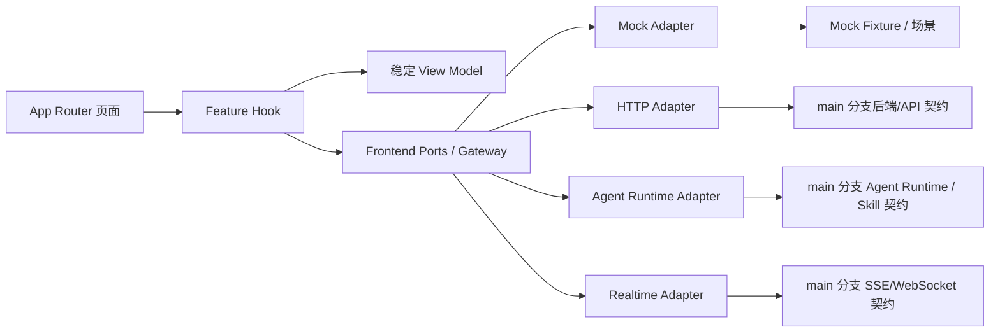
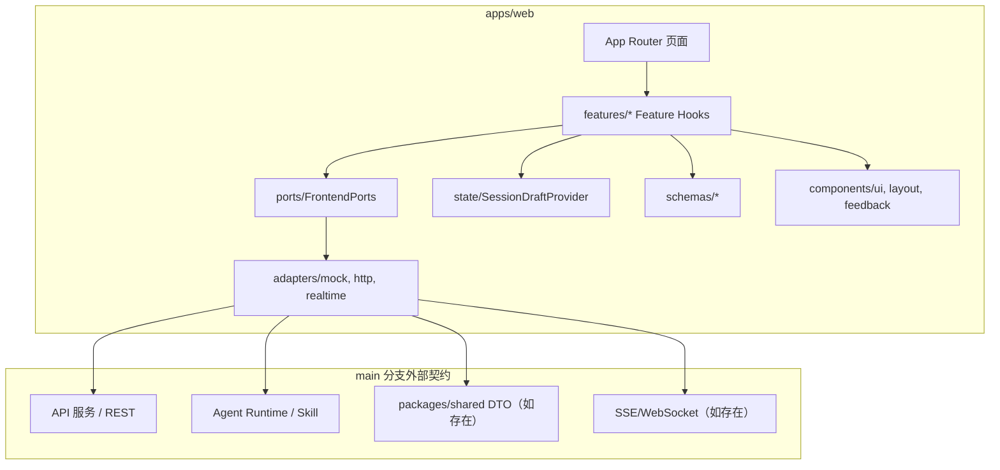
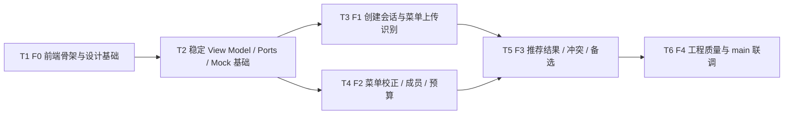

# RFC-0003: 前端多人点餐 Demo 架构与 main 分支接口适配

## 摘要

本 RFC 只定义多人点餐项目的前端架构、页面分期和接口适配策略，不直接设计或承诺后端 API 与 Agent Runtime 的最终契约。前端完成后的用户可见结果是：用户可以在 Next.js Demo 中完成“创建聚餐 → 上传/校正菜单 → 填写成员需求 → 设置预算优惠 → 生成推荐 → 查看结果与备选方案”的主流程，并且在外部服务尚未稳定时仍可通过 Mock Adapter 完整演示。

核心设计采用“稳定 View Model + Port 接口 + Adapter 映射契约”：页面和 Feature Hook 只依赖前端稳定的 View Model 与 Gateway，HTTP/Agent/Realtime Adapter 负责把 `main` 分支上的最新后端接口、Agent Runtime 或 Mock 数据翻译成这些稳定模型。实现和联调均以 `main` 分支为准；如果 `main` 分支接口继续变化，前端只更新 Adapter 映射层和契约测试，不重写页面。

## 动机

当前 `main` 分支已有两份设计 RFC：RFC-0001 聚焦本地 NexAU 多人点餐 Agent，RFC-0002 聚焦系统架构、数据库和 REST API。参考前端详细设计文档则提出了更完整的六步会话 Demo、Gateway/Adapter 分层、Mock-first 验收和错误展示策略。两者之间存在两个关键风险：

1. 前端详细设计中的后端接口和 Agent 接口是占位，可能已经不适配 `main` 分支上的系统架构 RFC。
2. 如果前端页面直接依赖某个后端路径或 Agent 输出字段，一旦 `main` 分支接口变化，页面、状态管理和错误处理都会被牵连。

因此需要一份前端 RFC，把“前端稳定契约”和“外部接口映射”拆开：前端只承诺自己的 View Model、Ports、Mock 流程和工程质量；外部接口由 Adapter 对齐 `main` 分支最新契约。

## 设计

### 用户看到的完整流程

1. 用户打开首页或 `/session/new`，输入聚餐名称、人数、币种等基础信息。
2. 前端通过 `SessionGateway.createDraft` 创建会话草稿；URL 保留 `sessionId` 和当前步骤，刷新后可恢复。
3. 用户进入 `/session/[sessionId]/menu` 上传菜单图片或使用 Demo Fixture；前端展示上传、识别、低置信度和价格缺失状态。
4. 用户在 `/session/[sessionId]/menu/review` 校正菜单，并在 `/session/[sessionId]/members` 填写每位成员的自然语言需求与约束 Chip。
5. 用户在 `/session/[sessionId]/budget` 设置总预算、优惠和打包/共享相关假设。
6. 用户进入 `/session/[sessionId]/result` 发起推荐；前端展示生成中、成功、冲突、失败和可重试状态。
7. 用户查看主推荐方案、总价、理由、约束满足情况和备选方案；如返回修改菜单、成员或预算，前端生成新版本并保留来源修订信息。

失败时，前端不把关键问题降级成 Toast：价格缺失进入菜单问题摘要，严重过敏进入固定风险提示，无可行方案进入结果页冲突视图，外部响应格式异常则显示可重试的错误态。

### 概述

本 RFC 将前端拆成三层：

- **View Model 层**：页面真正需要的稳定数据结构，例如 `DiningSessionView`、`MenuSnapshotView`、`MemberView`、`PricingDraft`、`RecommendationPlanView`、`FrontendError`。
- **Port/Gateway 层**：前端内部能力边界，例如 `SessionGateway`、`MenuGateway`、`AgentRuntimeGateway`、`RecommendationGateway`、可选 `RealtimeGateway`。
- **Adapter 层**：把外部实现翻译成 View Model。当前包括 `Mock Adapter`、`HTTP Adapter`、可选 `Agent Runtime Adapter` 和可选 `Realtime Adapter`。

页面不直接拼接 API URL，不直接导入数据库 Client，不直接导入 Agent SDK，也不在组件中裸调用 `fetch`。页面只依赖 Feature Hook；Feature Hook 只依赖 Gateway；Gateway 的具体实现由 `createFrontendPorts(mode)` 注入。

### 概念模型

图读法：页面只消费稳定 View Model；Gateway 是前端内部能力边界；Adapter 是唯一允许接触外部契约的层；`main` 分支上的后端、Agent Runtime 或实时协议变化，只应影响 Adapter 映射和契约测试，不应影响页面组件。

### 关键设计决策

#### 1. 前端范围固定为 View Model、Port、Adapter 和页面分期

本 RFC 只覆盖前端 Demo 架构，不重新设计后端数据库、推荐引擎、Agent Runtime 或部署拓扑。RFC-0002 中规划的 `apps/api`、`services/agent`、`docker/`、`packages/shared` 等模块只作为外部依赖来源；本 RFC 不承诺这些模块的最终字段和路径。

理由：用户明确要求“仅前端 RFC”，且 `main` 分支上的接口仍可能变化。前端应定义自己能稳定维护的 UI 契约，把外部变化隔离在 Adapter 层。

#### 2. Adapter 映射契约是前后端适配的唯一入口

前端定义稳定的 `FrontendPorts` 和 View Model。HTTP/Agent/Realtime Adapter 必须以 `main` 分支最新接口契约为准做映射：读取 `main` 分支上的 RFC、实现代码或共享 DTO，把外部字段转换为前端 View Model；响应时再把 View Model 或用户操作转换为外部请求。

理由：RFC-0001 的 Agent 输出和 RFC-0002 的 REST API 都不是完整前端 Demo 的稳定 UI 契约。若页面直接依赖它们，接口字段变化会直接破坏页面。Adapter 映射契约能同时满足“参考前端详细设计”和“以 main 分支为准”的要求。

#### 3. 默认 Mock-first，HTTP/Agent 未冻结前不阻塞前端验收

默认 `NEXT_PUBLIC_RUNTIME_MODE=mock`。Mock Adapter 必须覆盖 happy path、低置信菜单、价格缺失、成员过敏、解析失败、预算冲突、硬约束冲突、优惠组合、备选方案、版本冲突和网络失败等场景。HTTP/Agent Adapter 在 `main` 分支接口未冻结时可以返回 `IntegrationNotConfiguredError`，但页面必须能优雅展示该状态。

理由：前端完成标准不是“页面能打开”，而是主流程所有状态均可演示。外部依赖未接入时，Mock-first 能保证页面、状态、错误和测试先行。

#### 4. 状态按归属拆分，禁止单一全局 Store

前端状态分为五类：URL 状态（`sessionId`、当前步骤）、远端状态（Query Cache）、流程草稿（Session Draft Store）、表单状态（Form Instance）和纯 UI 状态（组件本地状态）。URL 中保留 `sessionId` 和当前步骤；敏感草稿默认不进入浏览器持久化。

理由：参考前端详细设计明确要求页面切换不丢失草稿、刷新后可恢复，同时也要求远端数据、表单草稿和纯 UI 状态分离。单一全局 Store 会混入敏感成员需求、菜单图片和表单 dirty 状态，增加隐私和恢复复杂度。

#### 5. 金额、约束和推荐结果使用前端稳定 View Model

后端 `main` 分支可能使用 `price_cents`、`budget_cents` 等整数分字段；前端 View Model 使用 `Money`、`PriceField`、`PricingDraft` 和 `RecommendationPlanView` 表达展示和校验需求。Adapter 负责金额单位换算、字段缺失、枚举映射和错误归一化。

理由：参考系统设计 RFC-0002 明确价格用整数分存储，RFC-0001 示例又使用元单位。前端必须避免在页面中混用金额单位，也不能把后端数据库字段直接暴露给 UI。

#### 6. Agent 与确定性逻辑边界由前端 UI 表达

前端可以调用 `AgentRuntimeGateway.parseMemberRequirement` 和 `answerClarification`，但推荐结果页必须把价格、硬约束、预算、优惠和最终可行性视为确定性程序负责的事实。Agent 输出只能作为解析、解释或辅助信息；如果 Agent 解析失败，用户仍可手工添加或修正约束。

理由：系统设计报告明确“Agent 做理解，确定性程序做价格/约束/优化校验”。前端 UI 需要反映这条边界，避免把 Agent 的自然语言解释当成最终可行性证明。

### 接口契约

#### 前端内部 Port 契约

前端内部 Port 是稳定契约。页面和 Feature Hook 只依赖以下能力，不依赖具体 HTTP 路径或 Agent SDK。

| Port | 主要能力 | 稳定输出 | 外部实现 |
|---|---|---|---|
| `SessionGateway` | 创建/恢复会话、保存草稿、变更步骤 | `DiningSessionView`、`revision` | Mock、HTTP Adapter 映射 `main` 分支会话或推荐接口 |
| `MenuGateway` | 上传菜单、启动识别、查询任务、读取菜单快照、保存校正、确认菜单 | `MenuImageView`、`MenuSnapshotView`、`EditableMenuItem`、`AsyncJobView` | Mock、HTTP Adapter、未来 OCR/视觉服务 Adapter |
| `AgentRuntimeGateway` | 解析成员自然语言需求、回答澄清问题 | `ParsedRequirementView`、`EditableConstraint` | Mock、Agent Runtime Adapter 映射 `main` 分支 Agent/Skill 契约 |
| `RecommendationGateway` | 发起推荐、查询任务、读取方案、生成备选方案 | `RecommendationPlanView`、`AlternativePlanSummary`、`AsyncJobView` | Mock、HTTP Adapter 映射 `main` 分支推荐接口 |
| `RealtimeGateway` | 订阅会话/任务事件 | `SessionRealtimeEvent` | 可选；Mock 或 SSE/WebSocket Adapter |

这些 Port 的名称和 View Model 参考前端详细设计文档，但本 RFC 不把它们等同于 `main` 分支后端 API。Port 是前端稳定契约；外部 API 是 Adapter 的输入。

#### Adapter 映射契约

每个 HTTP/Agent/Realtime Adapter 必须维护一个明确的映射说明，至少包含：

| 字段 | 说明 |
|---|---|
| `frontendOperation` | 前端 Port 方法，例如 `MenuGateway.startExtraction` |
| `mainBranchSource` | `main` 分支上的来源：RFC 编号、文件路径、共享 DTO 或实现代码路径 |
| `externalOperation` | 外部方法或路径，例如 `POST /api/...`；如果尚未确定，则标记为未配置 |
| `requestMapping` | 外部请求字段如何从前端 View Model 映射 |
| `responseMapping` | 外部响应如何转换为前端 View Model |
| `errorMapping` | 外部错误如何转换为 `FrontendError` |
| `contractCommit` | 联调时对应的 `main` 分支 commit SHA 或 RFC 版本 |

当前 `main` 分支已有 RFC-0002 的菜品 CRUD、推荐接口和图片候选接口，例如 `/api/menu-items`、`/api/recommendations`、`/api/menu-images`；系统设计参考包还提出 session-centered 路径，例如 `/api/sessions`、`/api/jobs`、`/api/sessions/:id/recommendations`。本 RFC 不强制采用任一列表作为最终后端契约。实现时，Adapter 必须在 `main` 分支最新代码或 RFC 中确认路径和字段，再写入映射说明和契约测试。

#### 前端稳定 View Model 摘要

| View Model | 前端用途 | 关键字段 |
|---|---|---|
| `DiningSessionView` | 创建、恢复、步骤跳转、布局标题 | `id`、`title`、`mealType`、`currency`、`peopleCount`、`currentStep`、`phase`、`revision` |
| `MenuImageView` | 上传、预览、排序、删除、质量提示 | `id`、`pageIndex`、`previewUrl`、`rotation`、`quality` |
| `EditableMenuItem` | 菜单校正、价格确认、过敏/辣度/份量编辑 | `id`、`name`、`price: PriceField`、`ingredientTags`、`allergenCandidates`、`spiceLevel`、`confidence` |
| `MemberView` | 多成员需求输入和约束 Chip | `id`、`name`、`requirementText`、`constraints`、`clarificationQuestions` |
| `PricingDraft` | 预算、优惠、税费、打包分配 UI | `budget: Money`、`promotions`、`takeoutAllocations`、`assumptions` |
| `RecommendationPlanView` | 结果页、冲突页、备选方案、版本恢复 | `id`、`version`、`status`、`planItems`、`pricing`、`memberCoverage`、`unmetConstraints`、`reasons`、`alternatives` |
| `FrontendError` | 统一错误展示和重试 | `code`、`title`、`message`、`retryable`、`fieldErrors`、`traceId` |

外部响应必须先经过 Schema 校验，再转换为上述 View Model。Schema 校验失败时，不使用部分不可信数据继续渲染关键结果。

#### 错误和冲突契约

| 场景 | 前端展示位置 | 用户动作 |
|---|---|---|
| 单字段校验失败 | 字段下方 | 修正字段 |
| 菜单价格缺失 | 固定问题摘要栏 + 菜品行 | 补充价格或标记时价/人工估价 |
| 菜单识别低置信 | 菜品行和证据面板 | 人工校正 |
| 成员严重过敏 | 成员页固定风险条 + 结果页风险提示 | 确认或调整约束 |
| Agent 解析失败 | 成员需求解析状态区 | 重试或手工添加约束 |
| 无可行推荐 | 结果页冲突视图 | 放宽软约束、提高预算、减少打包成员或返回修改 |
| 外部响应格式异常 | 页面级 ErrorState | 重试 |
| Adapter 未配置 | 开发/联调提示区 | 切换 Mock 或配置 `NEXT_PUBLIC_API_BASE_URL` |

### 架构图

### 范围与非目标

#### 本 RFC 范围

- 定义前端 Demo 的六步路由、页面分期和状态边界。
- 定义前端稳定 View Model、Port/Gateway 和 Adapter 映射策略。
- 明确默认 Mock-first，以及 HTTP/Agent Adapter 如何以 `main` 分支最新契约为准。
- 定义错误展示、Schema 校验、响应式、可访问性和测试策略。
- 将参考前端详细设计文档中的 Gateway、Adapter、Mock、状态和验收清单适配到当前 `main` 分支 RFC 体系。

#### 非目标

- 不实现或修改后端 API、数据库 schema、推荐引擎、Agent Runtime 或 Docker 部署。
- 不把 RFC-0001 的 Agent 输出或 RFC-0002 的 REST API 直接固定为前端永久契约。
- 不设计生产级鉴权、权限、分享邀请安全策略或敏感数据长期存储。
- 不承诺图片 OCR 自动准确入库；图片识别结果必须保留人工确认路径。
- 不把完整协作实时同步作为首期 Demo 必需能力；`RealtimeGateway` 为可选扩展。

## 权衡取舍

### 考虑过的替代方案

| 方案 | 优点 | 缺点 | 决定 |
|---|---|---|---|
| 页面直接调用 `main` 分支 API 路径 | 实现最快，Adapter 层少 | 接口字段变化会直接破坏页面；Mock-first 和测试困难 | 不采用 |
| 等后端和 Agent 接口完全冻结再写前端 | 外部契约更稳定 | 前端无法提前验证主流程、错误态和 Demo 体验 | 不采用 |
| 稳定 View Model + Port + Adapter 映射 | 页面稳定、Mock 可独立运行、外部变化隔离 | 需要维护映射表和契约测试，有额外抽象成本 | 采用 |
| 单一全局 Store 管理所有状态 | 短期代码集中 | 混淆远端、草稿、表单和 UI 状态，敏感数据持久化风险高 | 不采用 |
| 完整实时协作首期上线 | 协作体验完整 | 超出前端 Demo 首期范围，依赖鉴权和实时协议 | 延后 |

### 缺点

- Adapter 层会增加目录和映射维护成本，需要契约测试防止 Mock 与真实接口漂移。
- `main` 分支接口继续变化时，前端需要持续同步 Adapter 映射，不能只在初次实现时处理一次。
- Mock-first 能让前端先行，但如果 Mock 场景设计不真实，可能掩盖外部接口问题。
- 稳定 View Model 与后端字段之间存在映射损耗，例如金额单位、枚举、缺失值和版本信息需要谨慎处理。

## 实现计划

### 阶段划分

- [ ] F0：创建前端骨架、路由、设计 token、UI 基础组件和 RFC 目录初始化。
- [ ] F1：实现创建会话、菜单上传、识别任务 UI 和 Mock 流程。
- [ ] F2：实现菜单校正、成员需求解析、预算优惠页面与 Mock 场景。
- [ ] F3：实现推荐结果、冲突页、备选方案、版本和错误恢复。
- [ ] F4：补齐响应式、可访问性、测试、契约测试和 `main` 分支联调适配文档。

### 子任务分解

#### 依赖关系图

#### 子任务列表

| ID | 标题 | 依赖 | Ref |
| --- | --- | --- | --- |
| T1 | F0 前端骨架、路由、设计 token 与 RFC 目录初始化 | 无 |  |
| T2 | 稳定 View Model、Schema、错误模型、Session Draft Store 与 Mock Ports | T1 |  |
| T3 | F1 创建会话、菜单上传、识别任务 UI 与 Mock 流程 | T2 |  |
| T4 | F2 菜单校正、成员需求、预算优惠页面与 Mock 场景 | T2 |  |
| T5 | F3 推荐结果、冲突页、备选方案、版本与错误恢复 | T3, T4 |  |
| T6 | F4 工程质量、响应式、可访问性、测试与 `main` 分支联调适配 | T5 |  |

#### 子任务定义

**T1: F0 前端骨架、路由、设计 token 与 RFC 目录初始化**
- **范围**: 在 `apps/web` 或项目约定的前端目录中初始化 Next.js App Router、TypeScript Strict Mode、Tailwind/CSS Variables、基础布局、路由骨架、README/启动说明，并确保本 RFC 的 meta 和索引一致。
- **验收标准**: 首页、`/session/new`、`/session/[sessionId]` 及六步路由占位可访问；基础布局包含 Header、Stepper、PageHeader、BottomActionBar；无裸 `fetch`；RFC 索引包含 RFC-0003。

**T2: 稳定 View Model、Schema、错误模型、Session Draft Store 与 Mock Ports**
- **范围**: 定义 `domain/`、`schemas/`、`ports/`、`state/`、`mocks/` 基础结构；实现 `DiningSessionView`、`MenuSnapshotView`、`MemberView`、`PricingDraft`、`RecommendationPlanView`、`FrontendError`、`AsyncJobView`；实现 `createFrontendPorts(mode)` 和 Mock Ports。
- **验收标准**: 所有外部响应类型经过 Schema 校验；Mock 能生成稳定 Session ID、菜单、成员、预算、推荐成功/冲突/失败场景；页面不依赖具体 HTTP 路径。

**T3: F1 创建会话、菜单上传、识别任务 UI 与 Mock 流程**
- **范围**: 实现创建聚餐、会话恢复、菜单上传、图片预览、识别任务状态、低置信提示和上传/识别失败重试；Mock 覆盖 `happy_path`、`low_confidence_menu`、`missing_price`、`network_failure`。
- **验收标准**: 用户可完成创建会话和菜单上传识别流程；菜单识别失败、价格缺失和低置信字段在主信息区可见；离开页面后返回能恢复任务状态。

**T4: F2 菜单校正、成员需求、预算优惠页面与 Mock 场景**
- **范围**: 实现菜单校正表/卡片、价格确认、过敏/辣度/份量编辑、多成员需求输入、Agent 解析状态、约束 Chip、预算和优惠表单；Mock 覆盖 `member_allergy`、`requirement_parse_failure`、`budget_conflict`、`hard_constraint_conflict`、`promotion_combo`。
- **验收标准**: 用户可以完成菜单校正、成员需求和预算优惠；严重过敏有固定风险确认；解析失败可重试或手工修正；预算/优惠字段有跨字段校验。

**T5: F3 推荐结果、冲突页、备选方案、版本与错误恢复**
- **范围**: 实现推荐生成任务、结果页、可下单摘要、价格 breakdown、成员覆盖、约束满足/未满足说明、冲突视图、备选方案、返回修改并生成新版本；Mock 覆盖 `alternative_plans`、`revision_conflict`。
- **验收标准**: 推荐成功、无可行方案、Agent 解释失败、求解失败和版本冲突均有明确 UI；无可行方案不是通用错误页；返回修改后能保留来源修订信息。

**T6: F4 工程质量、响应式、可访问性、测试与 `main` 分支联调适配**
- **范围**: 补齐响应式布局、键盘操作、ARIA、加载/错误态一致性、契约测试、组件测试、E2E 测试、Mock 场景测试和 `main` 分支联调适配说明。
- **验收标准**: 关键流程 E2E 通过；契约测试验证 Adapter 映射来自 `main` 分支最新 RFC/实现；代码扫描确认页面无裸 `fetch`、无数据库 Client、无 Agent Secret；桌面和移动端均可完成主流程。

### 影响范围

预期新增或修改：

- `apps/web/` 或前端根目录：Next.js 前端应用、路由、布局、页面和启动说明。
- `apps/web/app/` 或等价目录：App Router 页面、Session Layout、Loading/Error UI。
- `apps/web/features/`：按会话、菜单、成员、预算、推荐、分享拆分的 Feature Hooks 和组件。
- `apps/web/domain/`、`apps/web/schemas/`：稳定 View Model、Schema 校验和错误模型。
- `apps/web/ports/`：`SessionGateway`、`MenuGateway`、`AgentRuntimeGateway`、`RecommendationGateway`、可选 `RealtimeGateway`。
- `apps/web/adapters/`：Mock、HTTP、Agent Runtime、Realtime Adapter 和错误映射。
- `apps/web/state/`：Session Draft Provider 和 reducer。
- `apps/web/mocks/`：Fixture、场景、Mock Ports 和延迟配置。
- `docs/rfcs/0003-frontend-adapter-architecture.md`：本 RFC 设计文档。
- `docs/rfcs/meta/0003-frontend-adapter-architecture.json`：RFC 元数据和子任务状态。
- `docs/rfcs/README.md`：新增 RFC 索引行。

## 测试方案

### 单元测试

- Schema 校验：菜单、成员、预算、推荐结果和外部错误模型。
- Draft reducer：步骤切换、菜单校正、成员增删、预算修改、保存成功/失败、远端 revision 变化。
- Adapter mapping：Mock Adapter 场景、HTTP Adapter 字段映射、错误映射、金额单位换算。
- 业务校验：价格确认、成员 critical 约束确认、优惠范围、打包成员存在性、无可行方案冲突结构。

### 集成测试

- 使用 Mock Ports 跑通六步主流程：创建会话、上传菜单、校正菜单、成员需求、预算优惠、推荐结果。
- 使用契约测试验证 Adapter 映射说明中的 `mainBranchSource` 与 `main` 分支最新 RFC/实现一致。
- 使用 HTTP Adapter 在 `main` 分支 API 可用时跑通最小联调场景；API 未配置时返回可展示、可重试的 `IntegrationNotConfiguredError`。

### 端到端测试

- 桌面端：从首页创建聚餐到查看推荐结果。
- 移动端：完成上传、校正、成员需求、预算和结果查看。
- 错误态：菜单价格缺失、严重过敏、无可行方案、外部响应异常、版本冲突。
- 恢复：刷新页面后 URL 保留 `sessionId` 和当前步骤，Mock 任务状态可恢复。

### 质量门

- 组件和页面中不存在裸 `fetch`。
- 前端不包含数据库连接串、Agent Key 或其他服务端密钥。
- 所有外部响应进入页面关键渲染前都经过 Schema 校验。
- 过敏、预算、价格错误和无可行方案进入页面主信息区。
- 默认 `mock` 模式无需任何外部服务即可运行。

## 未解决的问题

- `main` 分支上的后端/Agent 接口字段可能继续变化。该问题保留到实现和联调阶段处理：每次接入真实接口前，必须以 `main` 分支最新 RFC、共享 DTO 或实现代码为准更新 Adapter 映射表和契约测试，并记录对应 `contractCommit`。

## 参考资料

- `/Users/leoli/Desktop/Project/claude/myorderguide-reference-2026-07-31/FRONTEND_DETAILED_DESIGN.md`
- `/Users/leoli/Desktop/Project/claude/myorderguide-reference-2026-07-31/SYSTEM_DESIGN_REPORT.md`
- `docs/rfcs/0001-nexau-ordering-agent.md`
- `docs/rfcs/0002-ordering-system-architecture.md`
- `main` 分支上的最新 RFC、共享 DTO、API 实现和 Agent Runtime 契约
